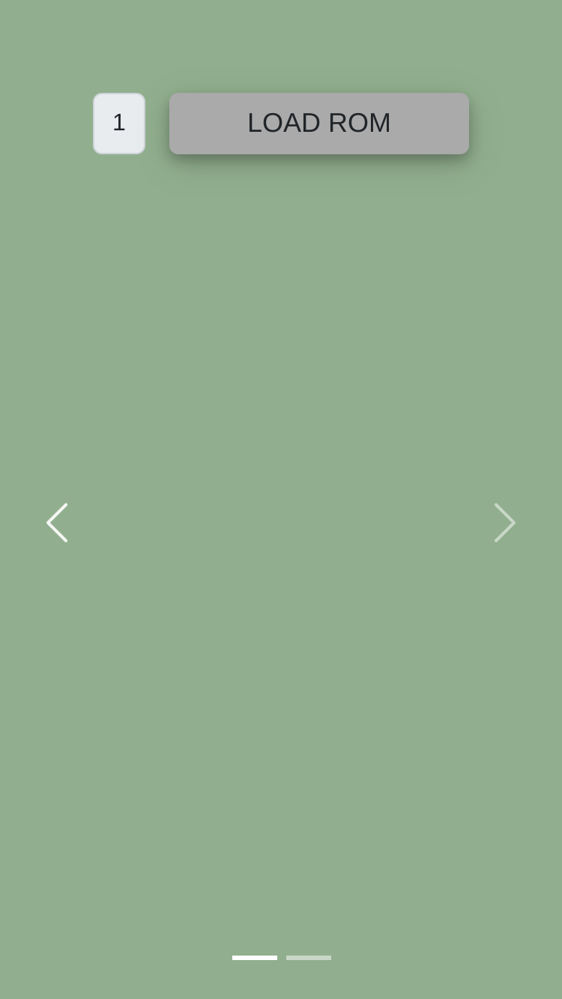
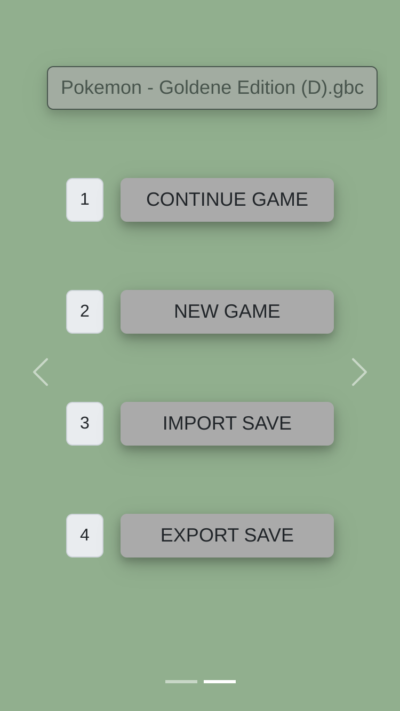
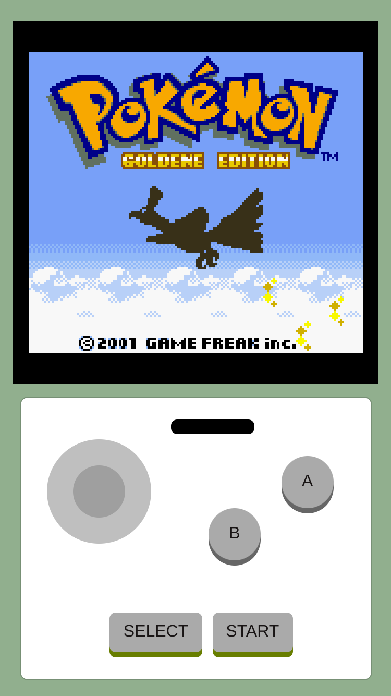

# PWABOY - Gameboy Emulator for Progressive Web Applications

Based on the awesome work of [Wasmboy](https://github.com/torch2424/wasmboy)

## Get Started

<svg fill="none" viewBox="0 0 800 600" width="800" height="600" xmlns="http://www.w3.org/2000/svg">
    <foreignObject width="100%" height="100%">
        

            
            

                

                    
Load your favorite game ROM

                     
                    
                

                

                    
You can proceed your recent game, start a new one, or load saved one.

                    
                

                

                    
Use the controls aligned like the original gameboy.

                    
                

            

        

    </foreignObject>
</svg>
